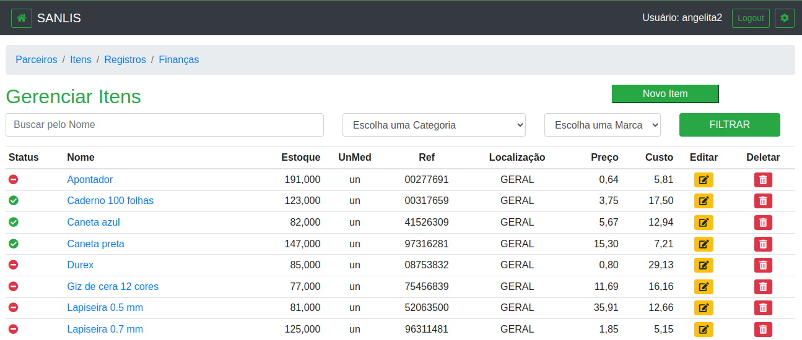
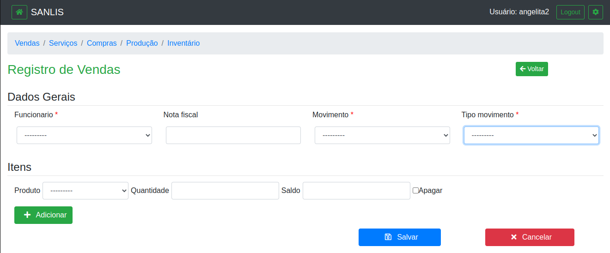

## SIG: Sistema Integrado de Gestão
### SanLis Consultoria Empresarial

#### GIT/GITHUB
criar um repositório novo
- git checkout -b main
- git init
- git add file.ext
- git commit -m 'commit Close #1'
- git remote add origin https://github.com/username/repository_name.git
- git push -u origin main

clonar o repositório
- git clone https://github.com/angelitasantos/sig-sanlis-django.git

#### ambiente virtual
- python3 -m venv venv
- source venv/bin/activate

#### bibliotecas
- pip install django
- pip install pillow
- pip install python-dotenv
- pip install django-widget-tweaks
- pip install django-bootstrap-form
- JQuery / ajax para atualizar saldo de estoque

#### criar/atualizar migrações
- python3 manage.py makemigrations
- python3 manage.py migrate

#### servidor local (ambiente virtual)
- python3 manage.py runserver

#### Links
[Python Decouple](https://pypi.org/project/python-decouple/)

[How to use Python Decouple](https://simpleisbetterthancomplex.com/2015/11/26/package-of-the-week-python-decouple.html)

[Widget Tweaks](https://pypi.org/project/django-widget-tweaks/)

[Class Based View - ccbv.co.uk](https://ccbv.co.uk/)

[Felipe Frizzo - Form Inline](https://felipefrizzo.github.io/post/form-inline/)

[Felipe Frizzo - Form Inline CBV](https://felipefrizzo.github.io/post/form-inline-cbv/)

[Django - Bootstrap](https://django-bootstrap-form.readthedocs.io/en/latest/)

